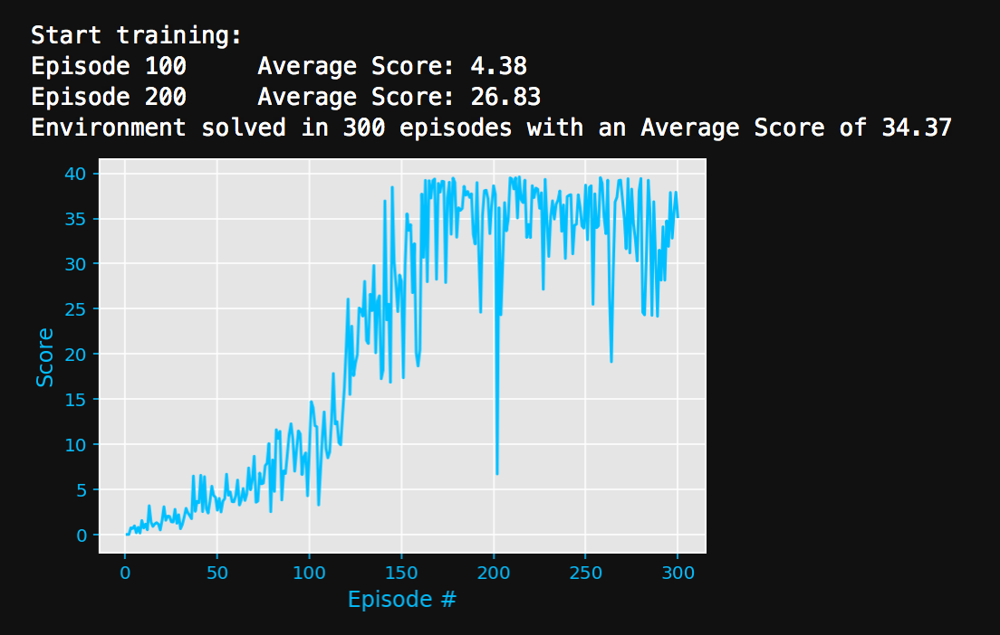
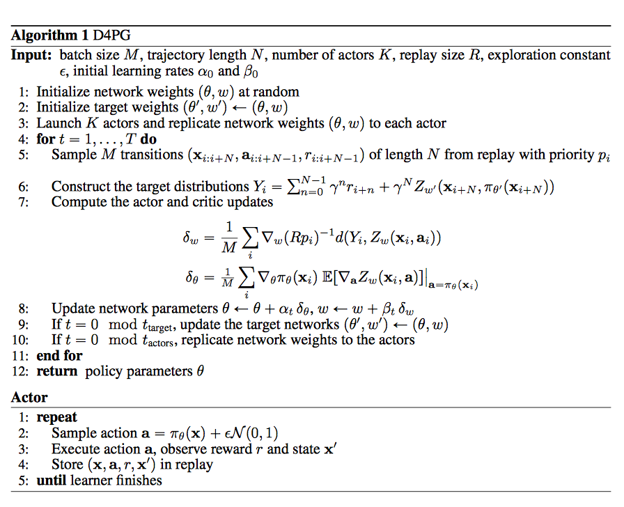

# Project 2 : Reacher Project (Continuous Control)

## Project's goal

In this environment, a double-jointed arm can move to target locations. A reward of +0.1 is provided for each step that the agent's hand is in the goal location. Thus, **the goal of the agent is to maintain its position at the target location for as many time steps as possible.**


## Environment details

The environment is based on [Unity ML-agents](https://github.com/Unity-Technologies/ml-agents). The project environment provided by Udacity is similar to the [Reacher](https://github.com/Unity-Technologies/ml-agents/blob/master/docs/Learning-Environment-Examples.md#reacher) environment on the Unity ML-Agents GitHub page.

> The Unity Machine Learning Agents Toolkit (ML-Agents) is an open-source Unity plugin that enables games and simulations to serve as environments for training intelligent agents. Agents can be trained using reinforcement learning, imitation learning, neuroevolution, or other machine learning methods through a simple-to-use Python API. 

The observation space consists of 33 variables corresponding to position, rotation, velocity, and angular velocities of the arm. Each action is a vector with four numbers, corresponding to torque applicable to two joints. Every entry in the action vector should be a number between -1 and 1.

- Set-up: Double-jointed arm which can move to target locations.
- Goal: The agents must move it's hand to the goal location, and keep it there.
- Agents: The Unity environment contains 10 agent linked to a single Brain.
  - The provided Udacity agent versions are Single Agent or 20-Agents
- Agent Reward Function (independent):
  - +0.1 Each step agent's hand is in goal location.
- Brains: One Brain with the following observation/action space.
  - Vector Observation space: 26 variables corresponding to position, rotation, velocity, and angular velocities of the two arm Rigidbodies.
  - Vector Action space: (Continuous) Size of 4, corresponding to torque applicable to two joints.
  - Visual Observations: None.
- Reset Parameters: Two, corresponding to goal size, and goal movement speed.
- Benchmark Mean Reward: 30

**In my implementation I have chosen to solve the First version of the environment (Single Agent) using the off-policy DDPG algorithm.** The task is episodic, and **in order to solve the environment, the agent must get an average score of +30 over 100 consecutive episodes.**


## Agent Implementation

### Deep Deterministic Policy Gradient (DDPG)

This project implements an *off-policy method* called **Deep Deterministic Policy Gradient** and described in the paper [Continuous control with deep reinforcement learning](https://arxiv.org/abs/1509.02971). 

> We adapt the ideas underlying the success of Deep Q-Learning to the continuous action domain. We present an actor-critic, model-free algorithm based on the deterministic policy gradient that can operate over continuous action spaces. Using the same learning algorithm, network architecture and hyper-parameters, our algorithm robustly solves more than 20 simulated physics tasks, including classic problems such as cartpole swing-up, dexterous manipulation, legged locomotion and car driving. Our algorithm is able to find policies whose performance is competitive with those found by a planning algorithm with full access to the dynamics of the domain and its derivatives. We further demonstrate that for many of the tasks the algorithm can learn policies end-to-end: directly from raw pixel inputs.

Deep Deterministic Policy Gradient (DDPG) is an algorithm which concurrently learns a Q-function and a policy. It uses off-policy data and the Bellman equation to learn the Q-function, and uses the Q-function to learn the policy.

More details available on the Open AI's [Spinning Up](https://spinningup.openai.com/en/latest/algorithms/ddpg.html) website.


### Algorithm


This algorithm screenshot is taken from the [DDPG algorithm from the Spinning Up website](https://spinningup.openai.com/en/latest/algorithms/ddpg.html)


### Code implementation

The code used here is derived from the "DDPG bipedal" tutorial from the [Deep Reinforcement Learning Nanodegree](https://www.udacity.com/course/deep-reinforcement-learning-nanodegree--nd893), and has been slightly adjusted for being used with the reacher environment.

The code is written in [Python 3.6](https://www.python.org/downloads/release/python-360/) and is relying on [PyTorch 0.4.0](https://pytorch.org/docs/0.4.0/) framework.

The code consist of :

- `model.py` : Implement the **Actor** and the **Critic** classes.
    - The Actor and Critic classes each implements a *Target* and a *Local* Neural Networks used for the training.
    
- `ddpg_agent.py` : Implement the **DDPG agent** and a **Replay Buffer memory** used by the DDPG agent.
    - The Actor's *Local* and *Target* neural networks, and the Critic's *Local* and *Target* neural networks are instanciated by the Agent's constructor
    - The `learn()` method updates the policy and value parameters using given batch of experience tuples.
        ```
        Q_targets = r + γ * critic_target(next_state, actor_target(next_state))
        where:
            actor_target(state) -> action
            critic_target(state, action) -> Q-value
        ```
  
- `Reacher_Project.ipynb` : This Jupyter notebooks allows to instanciate and train the agent. More in details it allows to :
  - Prepare the Unity environment and Import the necessary packages 
  - Check the Unity environment
  - Define a helper function to instanciate and train a DDPG agent
  - Train an agent using DDPG (including Hyperparameters evaluation)
  - Plot the score results

### DDPG parameters and results

#### Methodology

As a starting point, the initial version of the DDPG agent used the parameters values described in the paper [Continuous control with deep reinforcement learning](https://arxiv.org/abs/1509.02971). 

As shown in the notebook, the initial results were not great with the project's reacher environment. I first tried to play with some of the parameters which I thought were important (network size, learning rate, discount factor...) but the results did not improved much.

At that point I decided to adjust the code so that being able to specify all the hyperparameters from the the training helper function used in the notebook. While this would allow to perform a proper hyperparameters search, it would be quite a heavy work considering the number of parameters and their possible values. But as it helped exploring the important parameters and compared different versions, I was able to find some interesting facts :

- When starting to explore with the hyper parameters, I quickly discovered that **Increasing the number of steps per episode** was a first important changes  for the agent to start learning (The more the better, while it impacts the training time. Also worth mentioning that the Udacity environment seems to finish an episode after 1000 steps)
- **Reducing the Sigma values** used in the Ornstein-Uhlenbeck noise process was another important change for the agent to start learning
- In the  paper [Continuous control with deep reinforcement learning](https://arxiv.org/abs/1509.02971) batch normalization was not used. However it turns out that it helped a lot in our case. More surprising, I usually add Batch Normalization before the Activation layers in Neural Networks. In this project, it looks like **adding the batch normalization layer after the activation layer** works better.
- As the environment state and action size is rather simple, **using smaller Neural networks** (less units) helped to improved the learning. 
- The last important tuning was to **adjust the learning rates used** : using some identical, and slightly higher values for both the actor and critic networks was the final change for the agent to become a great learner being able to solve the environment. 

#### DDPG parameters

The final version of my DDPG agent uses the following parameters values (These parameters are passed in the main training function `ddpg(...)` defined and called in the notebook.)

```
state_size = 33         # environment State size 
action_size = 4         # environment Action size 
buffer_size = int(1e5)  # replay buffer size
batch_size = 128        # minibatch size

gamma = 0.99            # discount factor
tau = 1e-3              # for soft update of target parameters

lr_actor = 2e-4         # learning rate of the actor 
lr_critic = 2e-4        # learning rate of the critic
weight_decay = 0        # L2 weight decay
actor_fc1_units = 128   # Number of units for the layer 1 in the actor model
actor_fc1_units = 128   # Number of units for the layer 2 in the actor model
critic_fcs1_units = 128 # Number of units for the layer 1 in the critic model
critic_fc2_units = 128  # Number of units for the layer 2 in the critic model
bn_mode = 2             # Use Batch Norm. - 0=disabled, 1=BN before Activation, 2=BN after Activation 
                        # (3, 4 are alt. versions of 1, 2)

add_ounoise = True      # Add Ornstein-Uhlenbeck noise
mu = 0.                 # Ornstein-Uhlenbeck noise parameter
theta = 0.15            # Ornstein-Uhlenbeck noise parameter
sigma = 0.1             # Ornstein-Uhlenbeck noise parameter
```

The **Actor Neural Networks** use the following architecture :

```
Input nodes (33) 
  -> Fully Connected Layer (128 nodes, Relu activation) 
    -> Batch Normlization
      -> Fully Connected Layer (128 nodes, Relu activation) 
         -> Ouput nodes (4 nodes, tanh activation)
```


The **Critic Neural Networks** use the following architecture :

```
Input nodes (33) 
  -> Fully Connected Layer (128 nodes, Relu activation) 
    -> Batch Normlization
      -> Include Actions at the second fully connected layer
        -> Fully Connected Layer (128+4 nodes, Relu activation) 
          -> Ouput node (1 node, no activation)
```
            

Both Neural Networks use the Adam optimizer with a learning rate of 2e-4 and are trained using a batch size of 128.

#### Results

Given the chosen architecture and parameters, our results are :



**These results meets the project's expectation as the agent is able to receive an average reward (over 100 episodes) of at least +30, and in 300 episodes only** 


### Ideas for future work

As discussed in the Udacity instructions, a further evolution to this project would be to train the 20-agents version. In that case, it might be better to use another algorithm like [PPO](https://arxiv.org/pdf/1707.06347.pdf), [A3C](https://arxiv.org/pdf/1602.01783.pdf), and [D4PG](https://openreview.net/pdf?id=SyZipzbCb) that use multiple (non-interacting, parallel) copies of the same agent to distribute the task of gathering experience.  

**Distributed Distributional Deterministic Policy Gradients** - [D4PG](https://openreview.net/pdf?id=SyZipzbCb) looks very interesting

> This work adopts the very successful distributional perspective on reinforcement learning and adapts it to the continuous control setting. We combine this within a distributed framework for off-policy learning in order to develop what we call the Distributed Distributional Deep Deterministic Policy Gradient algorithm, D4PG. We also combine this technique with a number of additional, simple improvements such as the use of N-step returns and prioritized experience replay. Experimentally we examine the contribution of each of these individual components, and show how they interact, as well as their combined contributions. Our results show that across a wide variety of simple control tasks, difficult manipulation tasks, and a set of hard obstacle-based locomotion tasks the D4PG algorithm achieves state of the art performance.


 (from the paper)

Another enhancement would be to replace the Ornstein-Uhlenbeck noise process with **parameter noise** as described in Open AI's paper [Parameter Space Noise for Exploration](https://arxiv.org/abs/1706.01905) 

> Deep reinforcement learning (RL) methods generally engage in exploratory behavior through noise injection in the action space. An alternative is to add noise directly to the agent's parameters, which can lead to more consistent exploration and a richer set of behaviors. Methods such as evolutionary strategies use parameter perturbations, but discard all temporal structure in the process and require significantly more samples. Combining parameter noise with traditional RL methods allows to combine the best of both worlds. We demonstrate that both off- and on-policy methods benefit from this approach through experimental comparison of DQN, DDPG, and TRPO on high-dimensional discrete action environments as well as continuous control tasks. Our results show that RL with parameter noise learns more efficiently than traditional RL with action space noise and evolutionary strategies individually.

See also :
- Open AI's blog post [Better Exploration with Parameter Noise](https://blog.openai.com/better-exploration-with-parameter-noise/)
- A [project repository](https://github.com/ikostrikov/pytorch-ddpg-naf/blob/master/param_noise.py) that might be helpfull to implement Parameter Noise in Pytorch (as the Open AI baseline models are currently implemented with Tensorflow)


### Misc : Configuration used 

This agent has been trained on my "Deep Learning Dev Box", which is basically a Linux GPU Server, running Docker containers (using Nvidia Docker 2), serving Jupyter Lab notebooks which are accessed remotely via a web interface (or a ssh connection) : unfortunately this setup does not seem suitable to run Unity ML agent, with the GPU and providing a display for for the agent (See [Unity documentation](https://github.com/Unity-Technologies/ml-agents/blob/master/docs/Using-Docker.md) for more details). Thus the headless / no visualization version of the Unity environment was used.
